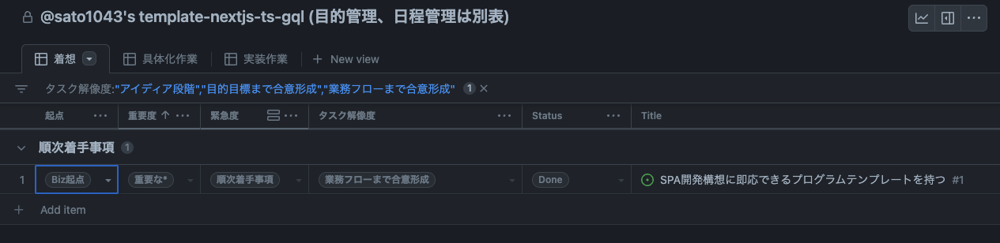

# Updater LLC.のプロジェクト運営（例

以下は弊社がプロジェクト運営した際のポイントなどを、ご参考のいただけるようまとめたものです。

ここでは、企画の発案からおおよそ時系列に、TODO を列挙していきます。

---

## 着想段階

プロジェクトのゴールを設定し、コミュニケーション手段を定めます。

### ゴール設定

はじめに、プロジェクトの目的と目標を設定します。

企画はビジネスオーナーとの対話の連続で進みます。
期待通りの QCD のバランスが保てるように境界線やトレードオフを明確にします。
それがあれば検討事項の合理性を判断できます。

- 目的にかなうか
- コストダウンできるか

以下の項目を穴埋めします（インセプションデッキ）；
 
<pre>
プロジェクト名：○○○
スポンサー：○○○
プロジェクトを行う根幹の理由：『○○○』
(少し噛み砕いて)このプロジェクトのエレベーターピッチをするなら(プレースホルダを穴埋めする)↓
• [潜在的なニーズを満たしたり、 潜在的な課題を解決したり] したい
• [対象顧客] 向けの、
• [プロダクト名] というプロダクトは、
• [プロダクトのカテゴリー] です。
• これは [重要な利点、対価に見合う説得力のある 理由] ができ、
• [代替手段の最右翼] とは違って、
• [差別化の決定的な特徴] が備わっている。
プロジェクトに関わるグループ構成、相関図:
重要事項のQCDについて、トレードオフ方針の整理: トレードオフスライダー「○○○ [min-0-1-2-3-4-5-max]」としてどの位置か
当面の予算額:
</pre>

### コミュニケーション手段の設定

運営のためにコミュニケーション手段を設定します。
会議体は就業形態に収まるよう調整して適用します。

- コミュニティ運営方針
- コミュニケーション方法
  - チャット、ミート、チケット共有、資料共有、コード共有
  - 内部会議体、外部会議体
  - オフラインイベント
- 発起会を開いて、ゴールの趣旨を前向きに伝える

### 管理表の作成

以降、「ゴールの複雑さ」と「日程の現実味」を２軸で管理していきます。
- 管理表を作成する
  - 目的
    - プロジェクト完了するため
    - 設計工程ではゴールが何か、その実現手順＝デザインを定義する
    - 実装工程ではデザインを実現する手順を実施する
  - 作り方
    - まず資料の目次表を作る。資料を開くとき、そこから必ず辿れるもの
    - プロジェクトのゴールを要件と日程、コストの３枚で管理する
      - 要件表はプロジェクトでの達成内容のリストになる。要件の複雑さを明らかにする。必要な作業と作業量を明らかにする
      - 日程表は作業を段取りして、地図にする（ネットワーク図と呼ぶ）。再遅のパスからリリース時期を仮定する
        - 現実に収まらない作業はなんらかトレードオフされるので注意する(明示的な仕様ドロップや暗黙な悪性リスクとの引き換えになる)
      - さらに、要件表と日程表を組み合わせてコスト表が作られる
    - 以上の内部資料から、顧客説明資料に転記できる概要表を生成できるよう整えておく（適宜ツール化しておく

また、作業量の見積もり基準をトラックしていきます。
- 作業サンプル表を作る
  - 目的
    - 実作業の日程を算出するガイドラインとして使う
    - 個々のメンバーに合わせたキャパシティ管理を行う
  - 作り方
    - まず作業完了まで作業している姿を大体のメンバーが想像できるような作業を、いくつか選ぶ。これをサンプルセットとする
    - 各メンバーそれぞれに、サンプルセットの完成までにかかる時間を想像してもらい、作業ごとに時間を記録する
    - サンプルセットを、メンバーの所要時間を鑑みつつ、所要時間順に並べ替える
    - サンプルセットの簡単なものから複雑なものの順で、作業を数字で重み付けする（１、３、５、６、９、および未知数
  - 留意点
    - 日々、新たな作業が見つかった際には、つど想定を追記する
    - 何か作業を行うのであれば、なんでも（設計、実装、運用、管理、種別問わず）追記する
    - サンプルセットは隔週程度で見直してゆく
      - メンバーごとの作業時間の見直しを行うことで、メンバーの現状に即した資料となり、かつ成長の可視化にも繋がる

---

## 具体化作業

着想が定まったところで、成果の具体性を深めます。

- ゴールの複雑さを定義する。その成果はゴールを複雑さの観点で整理した一覧になる（GH では project ボードと issue の一覧になる）。
- 機能を列挙分類して、明確なゴールを設定する。ゴールは適切なマイルストンで実施するよう設定する

### 機能の列挙

- ブレスト準備する
  - 重要な関係者のリスト
  - 各員の時間確保
  - 換気の良い部屋
  - ホワイトボードあるいは壁掛けの大きめのボード、壁に貼れる大きめの模造紙でも代用できるが壁に貼る手段が必要
  - 強粘着の大きめの付箋を２、３色
  - マーカー２、３色
- 機能をブレストで列挙する
  - やること
  - やらないこと
  - やるかやらないか考えていること
  - 危険因子
  - 困難な壁

### マイルストン設定

- 機能を「重要度 x 緊急度」で重み付け、仕分ける
  - 重要度（重大な、重要な、一般的な、劣後する、瑣末な）
  - 緊急度（着手優先事項、順次着手事項、対応不急事項）
  - 重要で緊急な機能から実装することになる
- 機能を、アプリケーションの成熟度における実現タイミングの観点で、マイルストンに分類する。以下例）
  - MVP / PMF / ベータ / リリース
    - MVP 1~n ... 最小限、プロジェクトの根幹機能を試せるだけの成果物。拙速に作り、内部トライアウトする
    - PMF 1~n ... MVP 機能をユーザに提供する上で必要になる肉付け。外部含めてトライアウトする
    - アルファ ... アプリケーションを公開する上で必要になる肉付けがおおむね終わった成果物
    - ベータ ... アプリケーションを公開する上で必要になる肉付けが終わった試験中の成果物
    - リリース 1~ ... 試験の終わった公開する成果物

### マイルストンを概算見積り

- マイルストン中の機能の概要を設計し、労力を概算見積りを得る
  - 機能をプロジェクト管理ツールでチケット化する
  - マイルストンを設計して概算見積もり作業を行う
  - マイルストン中の問題を一覧して振れ幅を仮定する
  - 対応に必要なスキル、配置計画
  - 実施内容の明確さに応じてタスク解像度を更新していく
    - アイディア段階
    - 目的目標まで合意形成
    - 業務フローまで合意形成
    - システム化概要まで合意形成
    - 机上シミュレーションまで合意形成
    - 実装可能性まで合意形成
    - マイルストン合意 （この工程ではここまで実施。以降は実装工程の解像度になる）
    - 実装内容まで合意形成
    - 実装は合意内容で進捗中
    - 実装に難あり要再合意

こちらは Github 管理での管理表の例です；

図のボードはタスク解像度で以下を絞り込んでいます
- 着想（アイディア段階〜業務フローまで合意形成
- 具体化作業（システム化概要まで合意形成〜マイルストン合意
- 実装作業（実装内容まで合意形成以降

また上記が具体化作業の縦軸とすると、別途横軸の検討事項として、[システムの具体化作業](/project-startup-service)を記述します。

---

## 実装作業

### Project Planing

- プロジェクトの目的目標を再確認する。
- マイルストンをスプリントに分割して、スプリントの期間目標を設定する
- 期間目標をネットワーク図に整理して、段取りに矛盾がないか整理する
 
以下はスプリント期間目標記述のテンプレ例；
<pre>
### Sprint #n @ 19XX/12/01 (01~05,5d) - 12/08 (08~10,3d)

- **_期間目標： ハンズオン期間_**

- メンバー編成、ハンズオン、チームコミュニケーションの形を訓練
- etc.etc.
</pre>

### Sprint Planing

- スプリント開始時期に実施
- プロジェクトの目的目標を再確認する。そこまでの現在位置をマイルストンから大まかに説明する。
- その後詳細を確認する
  - プロダクトバックログからスプリント内実施項目をピックアップ
  - 実装方式の詳細を実装開始可能な粒度まで会話で定義
  - 短く休憩を挟みつつ２、３時間程度。午後一杯やるイメージ

### Sprint Look back

- スプリント終了時期に実施
- チームがチーム行動様式を受け入れらているか、行動様式のチェックリストに基づいて確認する
  - 計画を PDCA / KPT
  - なにが初めてだったか
  - ナレッジがあったか、ナレッジは然るべきタイミングで共有されたか、ナレッジを記録したか
  - やりきった人をその場で、つどつど褒める
  - 短く休憩を挟みつつ２、３時間程度。午後一杯やるイメージ
- 行動様式チェックリスト
  - チームとして向上しゴールを達成するために、行動様式をチェックリスト化する。
  - ふと我に返った時に参照できるように見かけやすい場所にコミットしておく
  - 何をしたら向上したか。今週も KEEP できたか。PROBLEM 仮説はあってそうか。TRY の効果はあったか、仮説はただしそうか。
  - 個人的には日々振り返るとよい（個人は始業前デイリー、合同はスプリント毎だとか）
- KPT 手順
  1. まず、KEEP を実施できた人の挙手をとって人数を加点とする。合計点を継続サンプルしてチームスクラム向上の目安とする。
  2. 次に、先週の TRY を実際に挑戦した人から意見をもらう。この挑戦について仮説を更新するか、安定継続とするかを決める（継続するなら KEEP に移す）。
  3. 新しい課題・仮説と挑戦を募る（ひとり２、３点、均等に会話する）
  4. ひと通り見返して、アイディアが出きったら終わり（ノーアイディアでもいったん許容する）

<pre>
# KPT フォーマットサンプル

### a. KEEP 継続しているか

- [ ] 仕事のポイントを意識する

  - KPT ... Keep/Problem/Try 良い行動を続けている/問題を発見する/改善に挑戦する
  - MMM ... M 目的 -> M 目標 -> M 問題
  - IPO ... I インプット -> P プロセス -> O アウトプット
  - QCD ... Q 品質、C 対価、D お届け
  - PDC ... P 計画、D 実施、C 振返り、なぜなぜ５回(QC)
  - 行動分析。どうやったらその行動が強化されるインセンティブが働くか？（やりたくなるには？ ハードルを下げるには？）
  - 楽しくやる。キリよくやる

- チームワークを最大化する

  - [ ] 挑戦しやすい環境を作る
    - トライして、早めに失敗する。小さく失敗することを推奨する
    - 小さな失敗がチャレンジなら、褒める
  - [ ] 聞きやすい環境を作る
    - 15 分〜考えて判らないことは聞く（やりたいこと、やったこと、判らないこと、３点揃えて持っていく
    - ペアプロで伝授する
  - [ ] 資料を改善する
    - 気づいたことをすこしづつ、つどメモを残す（整理は必要になってからでいい
    - メモをたどれば作業を再現できるような、手順を意識したメモを残す
  - [ ] 相互理解を持つチームを作る
    - 横断的なプロジェクト把握を役割とするメンバーを配置する
    - 何をいつやるのか、自分が必要なことを把握する（そのための横断的理解補助
    - コミュニケーションパスを減らす

- 実装速度を最大化する
  - [ ] 効率よく要件を把握する
    - ドメイン知識を仕入れて、ユーザーストーリーと issue を一致させる（このチケットはどのストーリーの話題ですか？みたいな質問になる
  - [ ] レビューをシンプルにする
    - レビューアの数を絞る
    - レビューを作業より優先する

---

### b. PROBLEM & TRY 発見した課題・仮説と挑戦（まだ決め手がない話題

- 仮説）ドメイン知識がない

  - どの資料が正なのか、聞けるようになるまで手間がある
    - 挑戦）資料の入口を定める。インデックスを置く

### c.廃棄項目

（ここには、決め手が判って KEEP に書き直した PROBLEM&TRY を一定期間保存する。） 
（２、３週間経っても使わないようなら消してしまう。）

**END**
</pre>

### Daily Scrum

- 始業時にアジェンダをチャットポスト（やったこと・やること・悩み
  - 集合するのであれば、日毎一回、スタンダップで実施
  - 集合しないのであればマネジャーが聞いて回ればいい
  - 会話が一言で終わらないならチームを解放して担当者のみで詳細をミーティング
- 各自のセットアップに弾みをつけるのが目的。15 分で済ます
- 朝会でチームに聞くこと
<pre>
  - やったこと
  - やること
  - メド
  - 相談したいこと
  - 他の人を手伝えること
  - やりきった人をその場で、つど褒める
</pre>
- 集中タイムを設けてスケジュールに入れる（毎日 14-16 時に、だとか）
- ペアプロは１セット２セッション、各セッションは別日にやると効果が高い（1st: やってみせる、2nd: させてみせる、実践では褒めてあげる）

以下デイリースクラムテンプレ
<pre>
MM/DD (aaa) daily sato1043

## やったこと

- いつ、どこ向けの、なんのトピックを、どのくらいをいつまでに、どうやったか、捗ったか

## やること

- いつ、どこ向けの、なんのトピックを、どのくらいをいつまでに、やるつもりか、捗りそうか
- 会議体を忘れない

## 困りごと、連絡相談、KPT 事項

- (なければこのセクショは省略

本日もよろしくお願いいたします
</pre>

## 伝え方、接し方

あとは、日々丁寧に接していけるようにできれば、コミュニケーションがうまくいくと思います。以下は私が以前利用した行動様式の抜粋です。

<pre>
- 最初に、相手に与えましょう
- 相手が知ってそうな単語を使いましょう
- 話すときはゆっくり話しましょう。文をひとつひとつ、話しましょう。なになにです。まる。なになにです。まる。こんな感じにしましょう
- 事を起こす前の検討段階では間違ってもいいのです。間違いを指摘してもらえるように、明確に間違えましょう
- 相手が何が欲しいのか、何に困っているのかを考えましょう。自分の気持ちを喋るのではなく、相手が何に困っているのか聞き出すことに専念しましょう
- 相手の質問に、まずはシンプルに答えましょう。 聞かれたことに対して一言「おっしゃる通りです」「事実と違います」くらいの
- 短い言い切りで始めて、すかさず「説明します」とつなげます（これを「結論から話す」と言います）
- 実際に起きたことと、それについて自分が思うことを別の文にしましょう（これらをそれぞれ、事実と解釈と言います）
</pre>

以上、ご参考でした。
**END**
